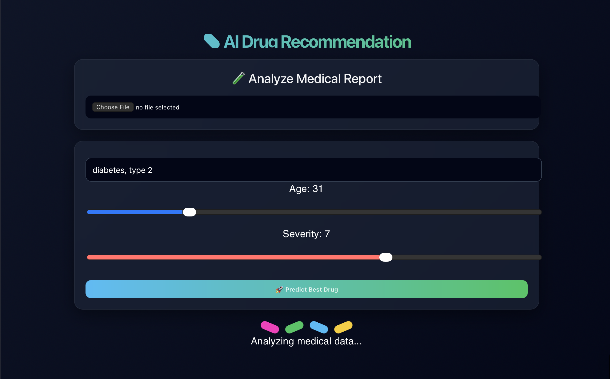
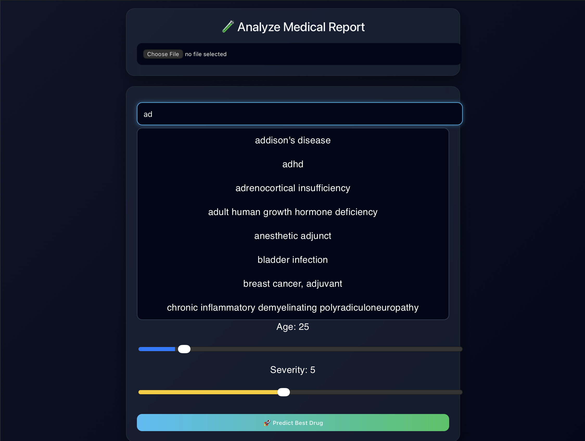
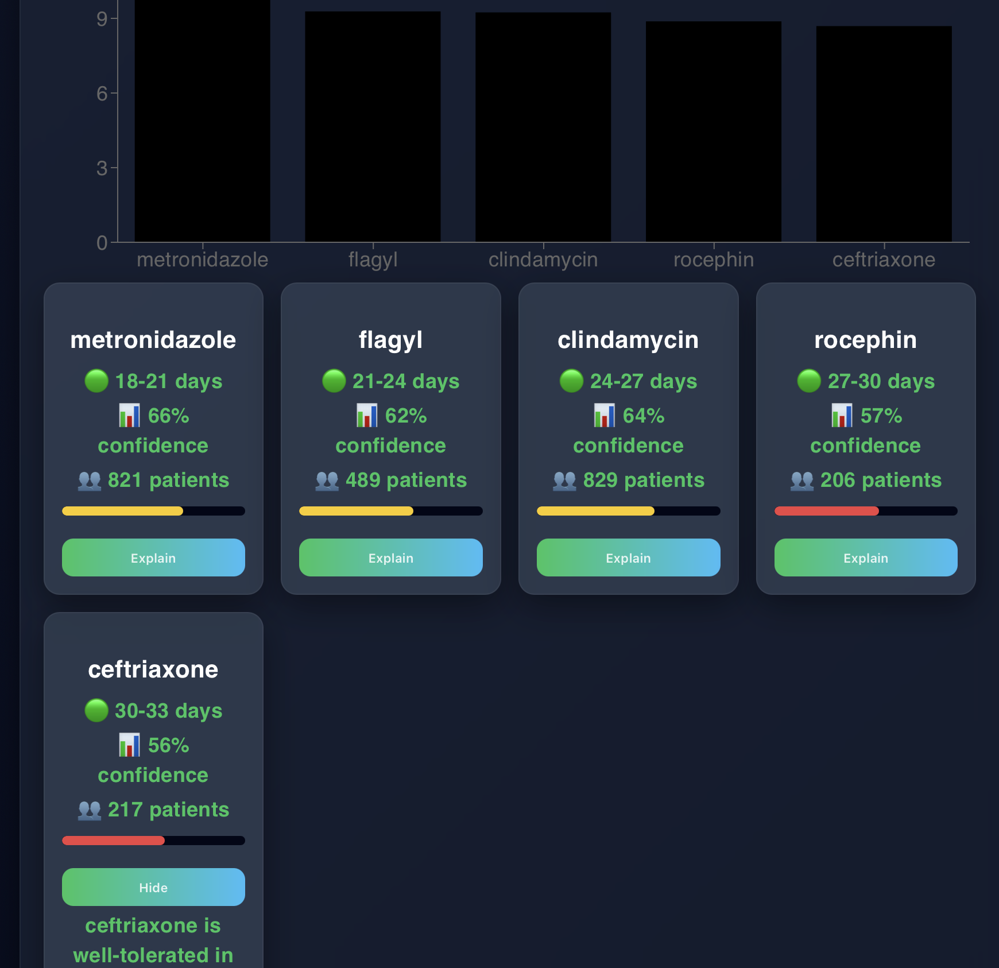

<h1 align="center">💊 AI Drug Effectiveness Prediction System</h1>

<p align="center">
  <b>Predict the most effective drug using ML + LLM based on real patient data</b>
</p>

<p align="center">
  
  
  
  
  
</p>

---

## 🎥 Demo Video

<p align="center">
  <a href="https://youtu.be/MpBNdcjojZE">
    
  </a>
</p>

---

## 🧠 Core Idea

This system compares different drugs used for the **same medical condition** and determines:

- ⏱️ **Recovery duration (days)**
- 📊 **Drug effectiveness across patients**
- ⚠️ **Side effect risk**
- 📃 **Medical reviews**
- 👥 **Patient review count**

👉 Goal: Identify the **most effective drug with faster recovery and fewer side effects**

---

## 🔥 Features

- ✅ ML-based drug ranking system  
- ⏱️ Recovery duration prediction (e.g., 18–21 days, 24–27 days)  
- 📊 Confidence score based on patient reviews  
- 👥 Patient count for real-world validation  
- 🤖 LLM-based personalized drug explanations  
- 📄 Blood report PDF → auto disease detection  
- 🔍 Smart condition search (fuzzy matching)  
- 🎯 Drug effectiveness comparison across multiple patients  

---

## 🧪 Machine Learning Models Used

- 🔹 **Regression Model (Scikit-learn)**  
- 🔹 **Feature Scaling (StandardScaler)**  
- 🔹 **Custom Hybrid Scoring System**  
- 🔹 **Fuzzy Matching (Difflib)**  

---

## 📊 How It Works

1. User inputs:
   - Condition  
   - Age  
   - Severity  

2. System:
   - Matches condition using fuzzy logic  
   - Filters relevant drugs  
   - Calculates effectiveness score  
   - Ranks top drugs  

3. Output:
   - 🏆 Best drug  
   - ⏱️ Recovery duration range  
   - 📊 Confidence score  
   - 👥 Number of patients  
   - 💡 Explanation (LLM)  

---

## ⚙️ Tech Stack

| Layer       | Technology |
|------------|------------|
| Frontend   | React.js |
| Backend    | Flask |
| ML         | Scikit-learn |
| LLM        | LLaMA (Local) |
| Data       | Pandas, NumPy |

---

## 🔄 System Flow

```mermaid
flowchart LR
A[User Input] --> B[Condition Matching]
B --> C[Drug Filtering]
C --> D[ML + Statistical Scoring]
D --> E[Top Drug Ranking]
E --> F[Recovery Time + Confidence]
F --> G[LLM Explanation]

<p align="center">
  
</p>
<p align="center">
  
</p>
<p align="center">
  
</p>

cd backend
pip install -r requirements.txt
python app.py

cd frontend
npm install
npm start

<p align="center">
  🚀 Built with passion for AI in Healthcare
</p>
```
